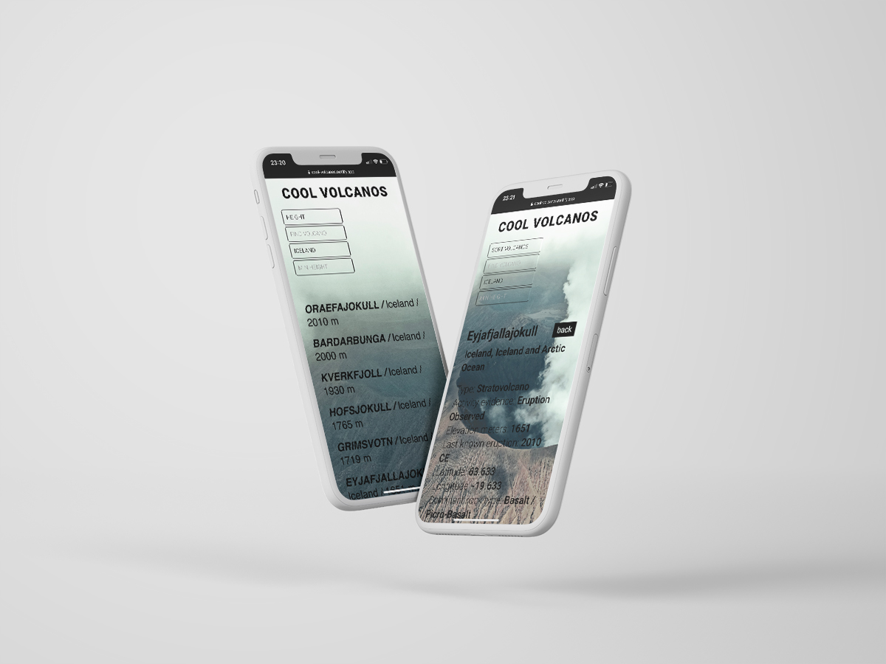

# Mongo API Project&ensp;|&ensp;[View Live &#10132;](https://cool-volcanos.netlify.app/)

Backend using Node and Express stored with mongoDB and mongoose. Frontend in React and styled with sass.

## Core Tech

- Node.js
- Express.js
- MongoDB
- Mongoose
- RESTful API
- React
- Sass

## Backend link

https://my-volcanos.herokuapp.com/volcanos/

## View it live frontend

https://cool-volcanos.netlify.app/
